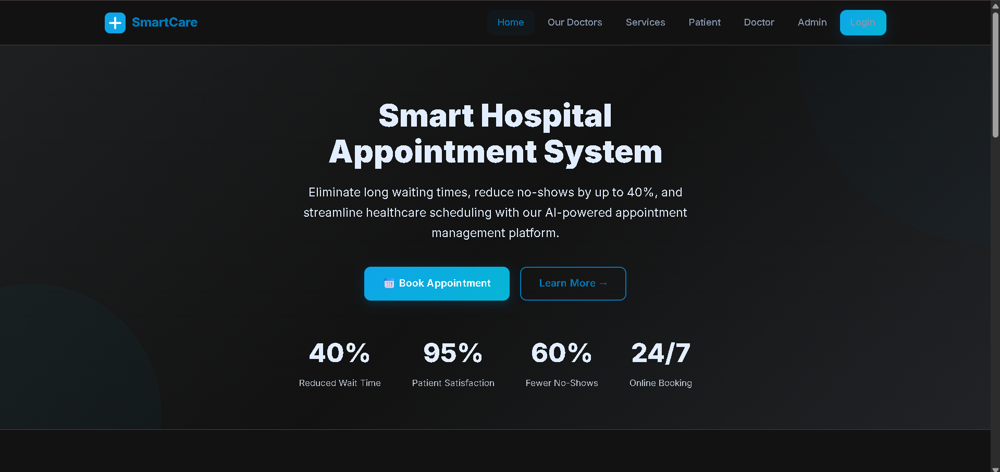
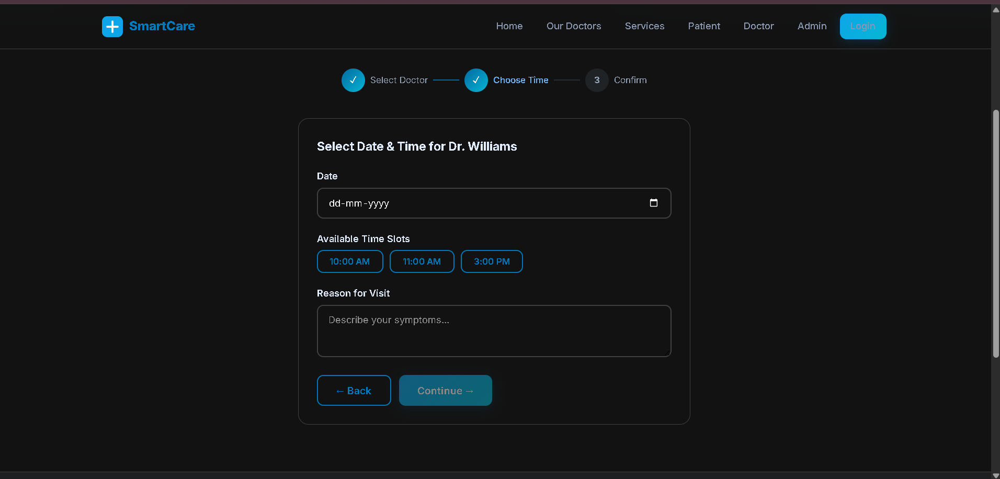
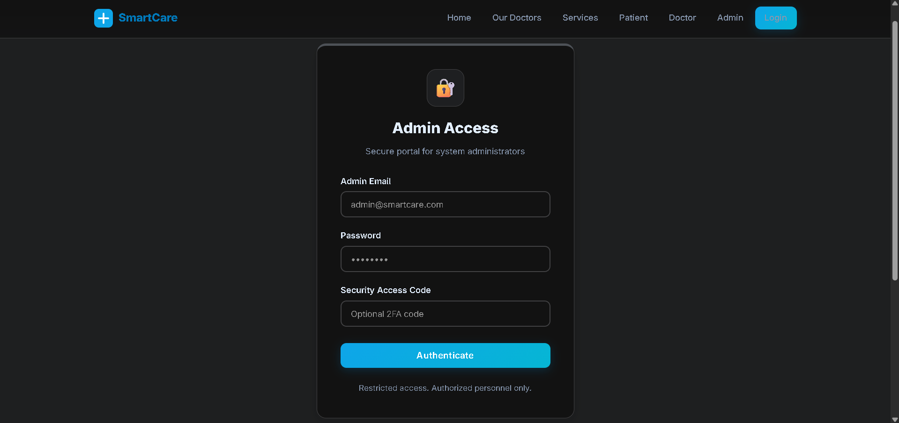
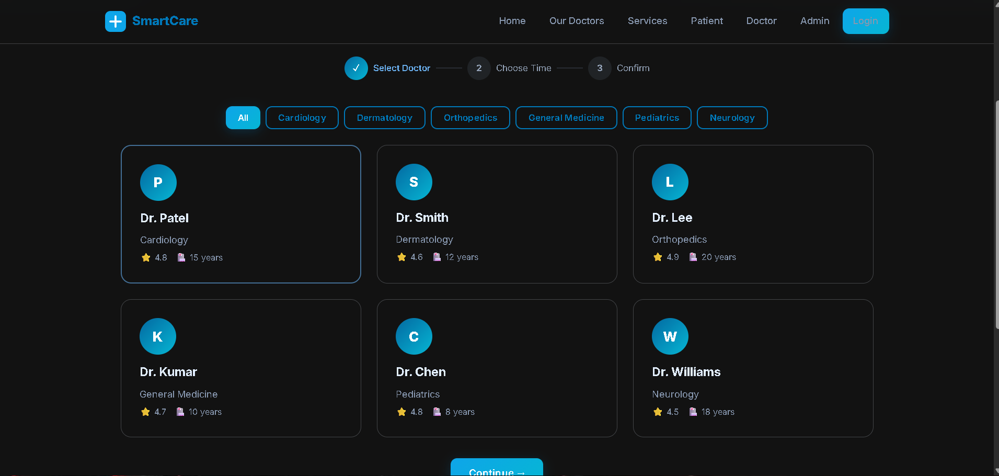
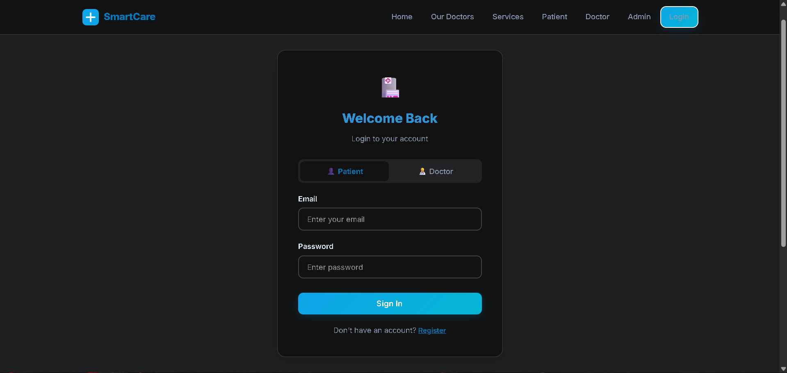

# 🏥 Hospital Appointment System (SmartCare)

## 📌 Overview

A web-based hospital appointment system that allows patients to book, manage, and track appointments with doctors efficiently. It also includes an admin dashboard for managing users and appointments.

---

## 🚀 Features

* 📅 Book and cancel appointments
* 👨‍⚕️ View doctors by specialization
* 🧑‍💻 Patient dashboard with reminders
* 🔐 Admin panel with analytics
* 📊 Appointment tracking system

---

## 🛠️ Tech Stack

* HTML
* CSS
* JavaScript (Vanilla JS)
* LocalStorage (for data handling)

---

## 🌐 Live Demo

👉 https://adithya9262.github.io/hospital-appointment-system/

---

## 📸 Screenshots

## 📸 Screenshots

### Home Page

### Patient Dashboard

### Admin Panel

### Doctors Page

### login Page

---

## ▶️ How to Run Locally

1. Download the project
2. Open `index.html` in browser

---

## 📈 Future Improvements

* Add backend (Node.js / Django)
* Database integration
* Authentication system
* Email/SMS notifications
* AI-based doctor recommendations

---

## 👨‍💻 Author

Adithya
